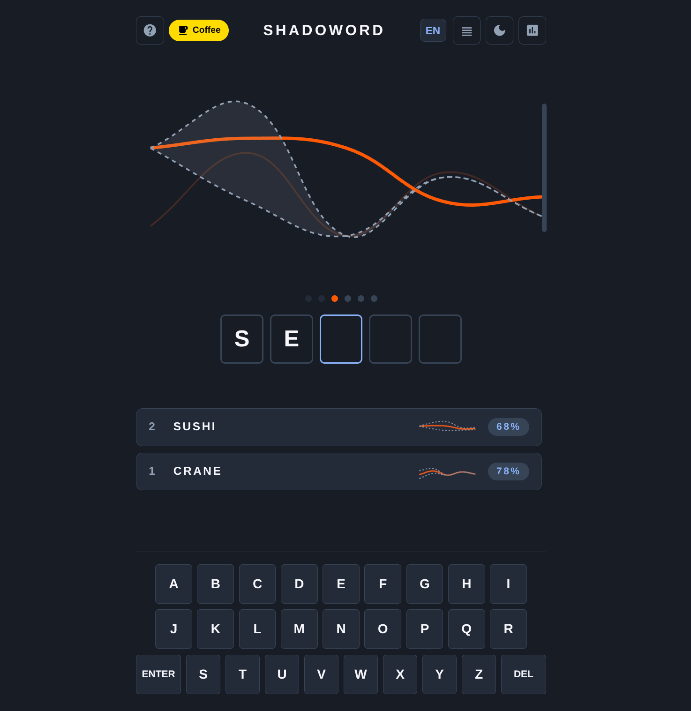

# ShadoWord 🌊

[](https://opensource.org/licenses/Apache-2.0)
[](https://www.python.org/)
[](https://flask.palletsprojects.com/)

**👉 [Play ShadoWord Live Here](https://shadoword.onrender.com) 👈**

**ShadoWord** is a multilingual, math-based twist on the classic daily word game. Instead of relying on green and yellow letter clues, players deduce the hidden word by analyzing its numerical "wave" and narrowing down the shrinking shadow boundaries.

<div align="center">
  
</div>

## 🧠 The Math Behind the Game
Every word forms a numerical wave based on its alphabetical values (`A=1`, `B=2` ... `Z=26`). 

When you guess a word, the game calculates the absolute difference between your guess and the hidden target word for each letter. Instead of telling you the exact letter, it generates a **Shadow**—an upper and lower boundary limit. The closer your guess is to the target word, the narrower the shadow becomes. Use these shrinking boundaries to deduce the correct letters in 6 tries!

## ✨ Features
* **Multilingual Dictionaries:** Play in English (EN), Spanish (ES), or Catalan (CA).
* **Visual Analytics:** Interactive, smooth-scrolling Chart.js interface that tracks your wave history.
* **Theming:** Toggleable Dark and Light modes that save to your local storage.
* **Shareable Results:** Generate emoji-based results to copy to your clipboard and challenge friends.
* **Responsive Design:** Custom virtual keyboard and mobile-first layout with safe-area padding.

## 🚀 Quickstart (Running Locally)

To run ShadoWord on your own machine for development or personal play:

1. **Clone the repository:**
   ```bash
   git clone https://github.com/Spartoons/ShadoWord.git
   cd ShadoWord
   ```

2. **Set up a virtual environment (optional but recommended):**
   ```bash
   python -m venv venv
   source venv/bin/activate  # On Windows use: venv\Scripts\activate
   ```

3. **Install dependencies:**
   ```bash
   pip install -r requirements.txt
   ```

4. **Run the application:**
   ```bash
   python shadow_war.py
   ```

5. **Play:** Open your browser and navigate to `http://localhost:5000`.

## 📁 Project Structure
* `shadow_war.py`: The main Flask application, game logic, and embedded HTML/CSS/JS.
* `words_en.txt`, `words_es.txt`, `words_ca.txt`: The local 5-letter dictionary files.
* `requirements.txt`: Python dependencies (Flask, gunicorn).
* `Procfile`: Production server configuration.

## ☕ Support the Project
If you enjoy the game and want to support its development and server costs, consider buying me a coffee!

<a href="https://buymeacoffee.com/shadoword" target="_blank"></a>

## 🤝 Acknowledgments & Disclaimers

* **Inspiration:** The core wave-mechanic concept of this game is heavily inspired by the brilliant original game **[WordWavr](https://wordwavr.app/)**. If you enjoy ShadoWord, please go check out the original concept that sparked this project!
* **AI Assistance:** As a developer, I utilized Artificial Intelligence tools (like Google's Gemini) to assist with code structure, UI debugging, and writing documentation for this project.
* **Dictionaries:** The fallback word lists are hardcoded, but the game relies on local text files (`words_*.txt`) for the full dictionary experience. Ensure these are populated with 5-letter words!

## 📄 License

This project is licensed under the **Apache License 2.0** - see the [LICENSE](LICENSE) file for details. You are free to use, modify, and distribute this software, provided you include the original copyright notice and state any changes made.
